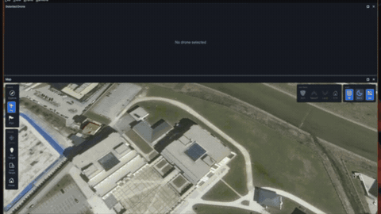
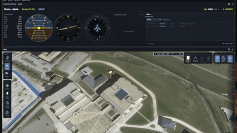
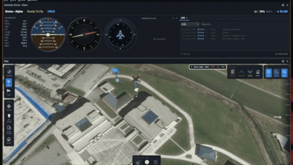
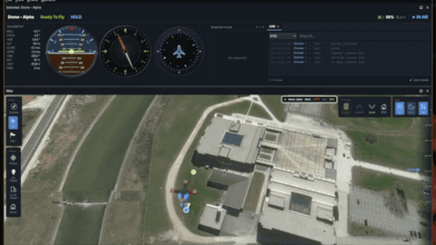
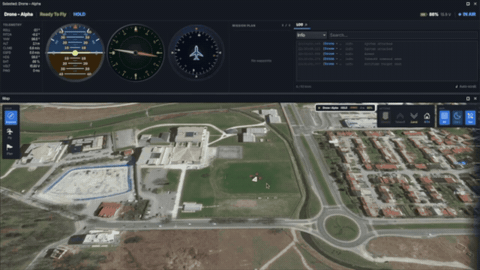
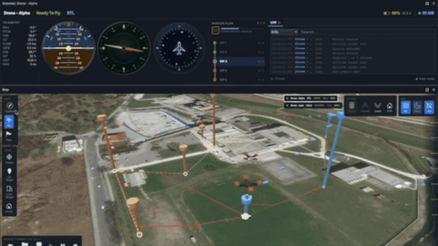
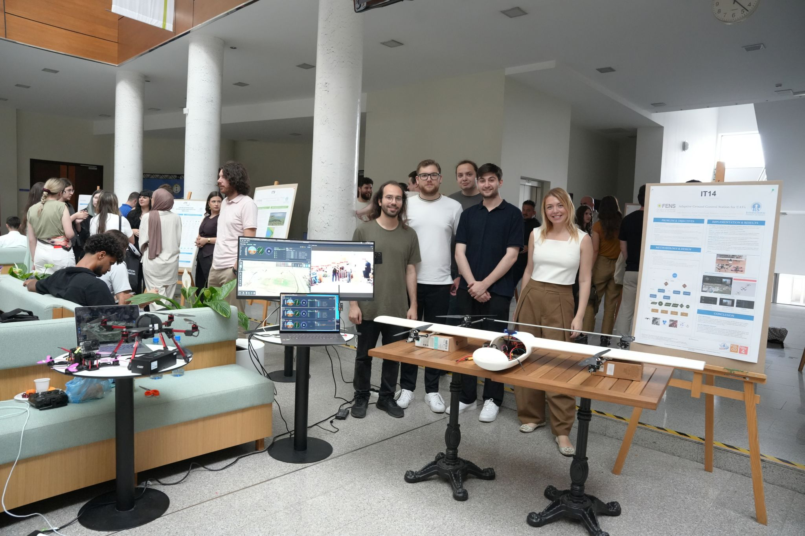
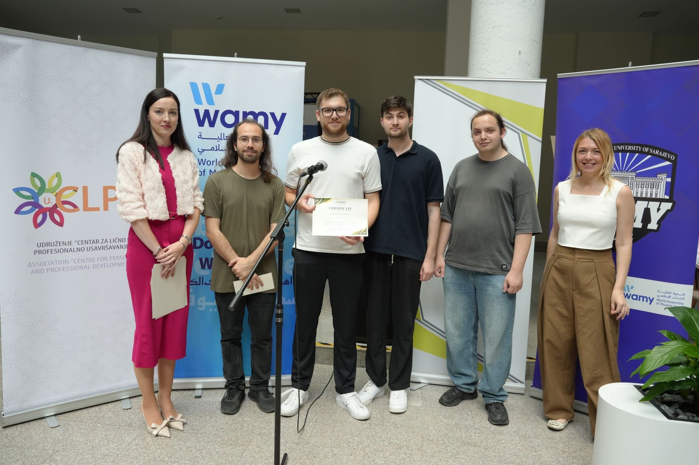

# Ground Control

[](LICENSE)
[](https://www.qt.io/)
[](https://en.cppreference.com/w/cpp/20)
[](https://cmake.org/)
[](https://mavlink.io/)
[](#platform-notes)

Qt6 QML docking application with KDDockWidgets.

## Flight Commands

<table>
  <tr>
    <td align="center" width="50%"><b>Connect</b><br><br></td>
    <td align="center" width="50%"><b>Takeoff</b><br><br></td>
  </tr>
  <tr>
    <td align="center" width="50%"><b>Go To</b><br><br></td>
    <td align="center" width="50%"><b>Land</b><br><br></td>
  </tr>
</table>

## Features

<table>
  <tr>
    <td align="center" width="50%"><b>Multi-Drone</b><br><br></td>
    <td align="center" width="50%"><b>Customization</b><br><br></td>
  </tr>
</table>

## Quick Start

```bash
git clone --recursive <repo-url>     # Clone with submodules
cd GroundControl
just build-dependencies              # Build KDDockWidgets library
just build                           # Build project
just run                             # Run application
```

## Requirements

- Qt 6.2+
- CMake 3.15+
- Ninja
- C++17 compiler
- Just (`cargo install just`)
- clang-format (formatting)
- clang-tidy (linting)
- GStreamer 1.x
- **Windows**: PowerShell (required for `just format`)

### GStreamer

GStreamer is required for camera/video streaming support.

| Platform | Install |
|---|---|
| **Linux (Debian/Ubuntu)** | `sudo apt install libgstreamer1.0-dev libgstreamer-plugins-base1.0-dev gstreamer1.0-plugins-good gstreamer1.0-plugins-bad gstreamer1.0-libav gstreamer1.0-tools` |
| **Linux (Fedora)** | `sudo dnf install gstreamer1-devel gstreamer1-plugins-base-devel gstreamer1-plugins-good gstreamer1-plugins-bad-free gstreamer1-libav gstreamer1-tools` |
| **macOS** | `brew install gstreamer` |
| **Windows** | Download from [GStreamer downloads](https://gstreamer.freedesktop.org/download/) - install both runtime and dev packages. Set `GSTREAMER_ROOT_X86_64` env var to the install path (e.g. `C:\gstreamer\1.0\mingw_x86_64`). |

Runtime plugins are also needed for stream decoding: `gst-plugins-good` (RTSP), `gst-plugins-bad` (hardware decode), `gst-libav` (H.264/H.265).

## All Commands

Run `just --list` to see all available commands.

### Build

```bash
just build-dependencies    # Build KDDockWidgets dependency library
just build                 # Build the project using CMake + Ninja
```

### Run

```bash
just run [BACKEND]         # Run application (BACKEND: xcb|wayland, Unix only)
```

On Unix: Omit BACKEND for default (xcb), or specify `xcb` or `wayland`.
On Windows: BACKEND parameter is ignored (uses native backend).

### Code Quality

```bash
just format [FILE]         # Format C++/QML files (all or specific file, PowerShell on Windows)
just lint [FILE]           # Run clang-tidy/qmllint (all files or specific file)
```

### Clean

```bash
just clean [TARGET]        # Clean build dir, LSP files, or all (TARGET: build|lsp|all, default: all)
```

## Platform Notes

### Unix (Linux/macOS)

Backend selection via `just run [xcb|wayland]`:
- **XCB (default)**: X11 via XWayland. Best docking support.
- **Wayland**: Native protocol. May have dual title bars/docking issues.

### Windows

- `just run` executes natively (no backend parameter)
- `just format` requires PowerShell for file globbing
- All other commands work identically to Unix

## LSP Support

CMake generates `compile_commands.json` for LSP clients. Use `just clean lsp` to remove.

## Contributing

See [CONTRIBUTING.md](CONTRIBUTING.md) for commit message guidelines.

## License

KDDockWidgets: GPL 2.0 or GPL 3.0. Contact KDAB for commercial licensing.

## The Team

<table>
  <tr>
    <td align="center" width="50%"><b>UAVs We Built</b><br><br></td>
    <td align="center" width="50%"><b>Award from Our University</b><br><br></td>
  </tr>
</table>
